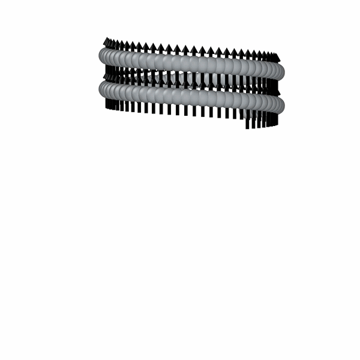

# Bonded-Particle Model for Magneto-Elastic Rods

<span style="color: red">⚠️ This site is still under development.</span>

## Overview

Flexible rods undergoing large deformations are ubiquitous in science and engineering — from biological cilia and magnetic filaments to surgical catheters and soft robots. Simulating these systems requires a framework that naturally handles geometric nonlinearity, contact, and coupling to external fields and fluids. Bonded-particle models (BPMs) treat solids as collections of discrete particles connected by deformable bonds, and fit naturally within the discrete element method (DEM) — a general, scalable framework with modular multiphysics capabilities. Despite this versatility, BPMs remain underutilized for slender elastic rods. Here, we develop a co-rotational BPM formulation for slender rods, implement it in [LAMMPS](https://www.lammps.org/), and demonstrate its broad applicability across mechanics, magnetics, and fluid–structure interaction.

<div style="display: grid; grid-template-columns: 2fr 1fr; gap: 1rem; margin: 1.5rem 0;">
  <div style="display: grid; grid-template-rows: 1fr 1fr; gap: 1rem;">
    <figure>
      
      <figcaption>Extreme twisting & plectoneme formation</figcaption>
    </figure>
    <figure>
      
      <figcaption>Fluid pumping by a magnetic cilia array</figcaption>
    </figure>
  </div>
  <figure style="display: flex; flex-direction: column; align-items: center; justify-content: center;">
    
    <figcaption>Helical rod with dipole–dipole interactions</figcaption>
  </figure>
</div>

## Citation

This page provides the implementation details and code for the work described in:

Alkuino, G., Clemmer, J. T., Santangelo, C. D., & Zhang, T. (2026). Bonded-particle model for magneto-elastic rods. [arXiv:2603.27279](https://arxiv.org/abs/2603.27279).

```bibtex
@article{alkuino_bpm_2026,
  author  = {Alkuino, Gabriel and Clemmer, Joel T. and
             Santangelo, Christian D. and Zhang, Teng},
  title   = {Bonded-particle model for magneto-elastic rods},
  journal = {arXiv preprint arXiv:2603.27279},
  year    = {2026}
}
```

Please also [cite LAMMPS](https://docs.lammps.org/Intro_citing.html) if you use the code.

## Getting Started

### Build Instructions

The model will be included in the **BPM** package starting from LAMMPS version **(TBD)**.
In the meantime, it is available on the `develop` branch of the [LAMMPS repository](https://github.com/lammps/lammps/tree/develop)
([PR#4945](https://github.com/lammps/lammps/pull/4945)).

To run all the examples on this site, [build LAMMPS](https://docs.lammps.org/Build.html) with these packages:

- **BPM** — Bonded-particle models
- **DIPOLE** — Dipole–dipole interactions for magnetic particles
- **GRANULAR** — Granular pair styles for contact mechanics
- **LEPTON** — String-expression-based potentials, used by `fix efield/lepton` for non-uniform fields
- **MOLECULE** — Molecule IDs for grouping particles

For fluid–structure interaction examples, the custom [CoupLB](https://github.com/tengzhang48/CoupLB) package is also required.

### Usage

The model can be used by invoking the bond style [`bpm/rotational`](https://docs.lammps.org/bond_bpm_rotational.html).

The bond style requires [`atom_style bpm/sphere`](https://docs.lammps.org/atom_style.html)
and [`fix nve/bpm/sphere`](https://docs.lammps.org/fix_nve_bpm_sphere.html) for time integration.
For magnetic examples, the `dipole` sub-style must be added via `atom_style hybrid`.
The `update dipole` keyword/value pair must be added to `fix nve/bpm/sphere` to use the magnetic model described in this work.

Bonds can be created using [`create_bonds`](https://docs.lammps.org/create_bonds.html) or defined directly in the [data file](https://docs.lammps.org/read_data.html).
The bond style and coefficients are specified as:

    bond_style bpm/rotational <keyword/values>
    bond_coeff type Kr Ks Kt Kb Fr_c Fs_c Tt_c Tb_c gr gs gt gb

The optional settings are:

| Keyword | Values | Description | Default |
|---------|--------|-------------|---------|
| `frame` | `average`, `particle` | `average` uses a symmetric central frame; `particle` uses one particle as reference | `average` |
| `damping` | `derivative`, `dem` | `derivative` damps strain rates; `dem` damps relative velocities | `derivative` |
| `break` | `yes`, `no` | Whether bonds can break during a run | `yes` |
| `normalize` | `yes`, `no` | Normalizes radial and shear forces by $r_0$ | `no` |
| `smooth` | `yes`, `no` | Smoothly interpolates forces to zero near breaking | `yes` |

For each bond type, 12 coefficients must be defined, in order:

| Coefficient | Description |
|-------------|-------------|
| $K_r$, $K_s$, $K_t$, $K_b$ | Radial, shear, twist, and bend stiffnesses |
| $f_{r,c}$, $f_{s,c}$, $\tau_{t,c}$, $\tau_{b,c}$ | Critical forces/torques for bond breaking |
| $\gamma_r$, $\gamma_s$, $\gamma_t$, $\gamma_b$ | Damping coefficients for each mode |

!!! note
    The method described in the paper uses `frame average` and `damping derivative` (both defaults).
    All examples use `break no` and `smooth no`, with one bond type since each BPM segment is identical.
    With `break no`, the critical force/torque values are ignored.

For more information, see the [*How to BPM*](https://docs.lammps.org/Howto_bpm.html) page.

## Examples

All examples are self-contained; the simplest is [Demo: Cantilever Beams](examples/cantilever-beam/index.md). The remaining examples assume familiarity with the basics covered there.

<div class="examples-grid">
<a href="examples/cantilever-beam/" class="example-card">
<div class="title">Demo: Cantilever Beams</div>
<div class="desc">Cantilever beam under static and dynamic loading</div>
</a>
<a href="examples/twisting-rod/" class="example-card">
<div class="title">Extreme Twisting & Plectoneme Formation</div>
<div class="desc">Straight and curved rods under extreme twisting with self-contact</div>
</a>
<a href="examples/magnetic-beam/" class="example-card">
<div class="title">Magnetic Beams</div>
<div class="desc">Magnetized beams in uniform and constant-gradient magnetic fields</div>
</a>
<a href="examples/helical-rod/" class="example-card">
<div class="title">Magnetic Helical Rods (under construction)</div>
<div class="desc">Magnetized helical rods with dipole–dipole interactions and mechanical hysteresis</div>
</a>
<a href="examples/fsi-oscillatory-flow/" class="example-card">
<div class="title">FSI: Oscillatory Flow (under construction)</div>
<div class="desc">Elastic filaments in oscillatory channel flow</div>
</a>
<a href="examples/fsi-cilia-array/" class="example-card">
<div class="title">FSI: Magnetic Cilia (under construction)</div>
<div class="desc">Fluid pumping by a cilia array with metachronal magnetization pattern</div>
</a>
</div>

---

## Miscellaneous

- **[Unit Systems](misc/unit-system.md)**

## License

Preprint under [CC BY 4.0](https://creativecommons.org/licenses/by/4.0/).
Source code and simulation scripts under MIT.

---

*This project page was created with AI assistance. All content was reviewed and edited by GA.*