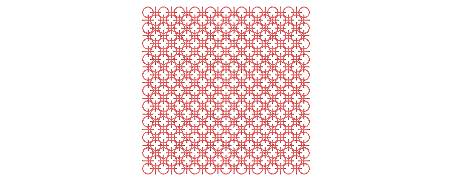
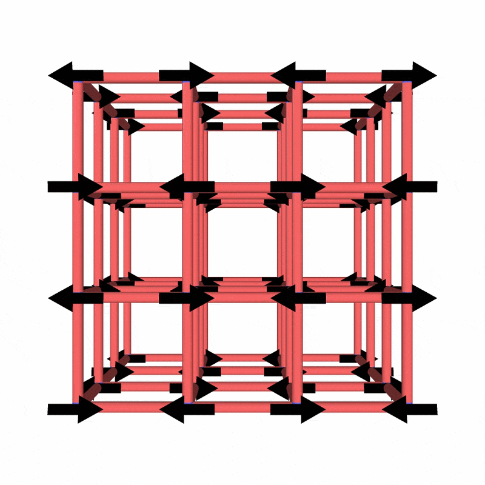

# Other cool examples not included in the paper

<figure style="display: flex; flex-direction: column; align-items: center; justify-content: center;">
    
    <figcaption>2D jellyfish-inspired magnetic swimming robot</figcaption>
</figure>

<figure style="display: flex; flex-direction: column; align-items: center; justify-content: center;">
    
    <figcaption>Polycatenated architected material with soft units</figcaption>
</figure>

<figure style="display: flex; flex-direction: column; align-items: center; justify-content: center;">
    
    <figcaption>Magneto-mechanical metamaterial</figcaption>
</figure>